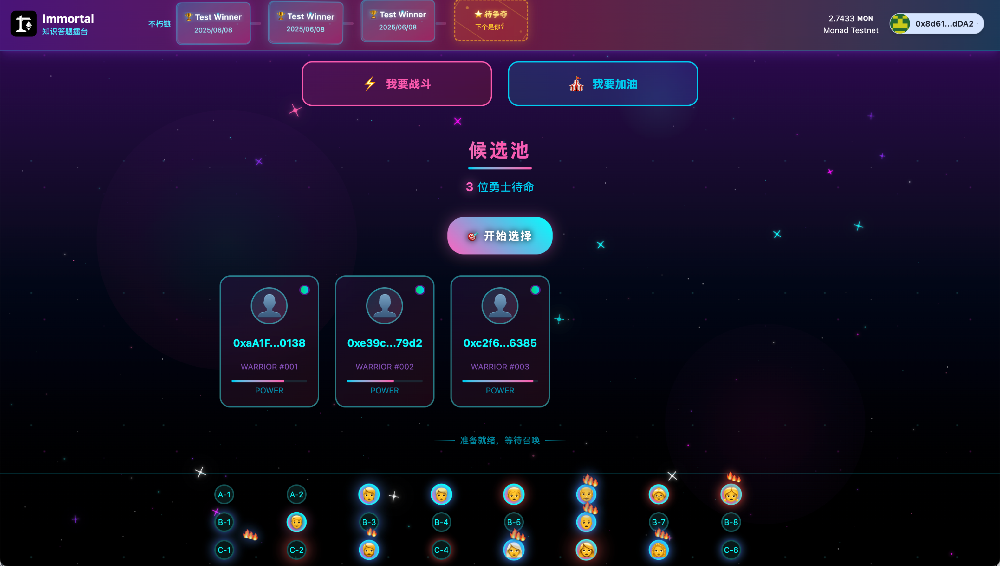
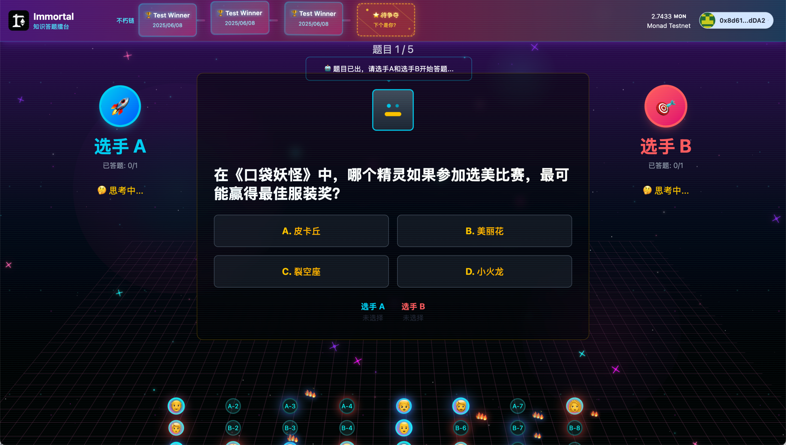

# Immortal 🥊

English | [中文](./README.md)

> A Web3 + AI-powered quiz arena battle game

## 🏆 Project Overview

Immortal is a Web3 + AI-powered quiz battle game styled like boxing matches. Users can participate in quiz duels or cheer for contestants as audience members. When contestants answer incorrectly consecutively, audience members can even replace them on stage to continue the battle. All match results are permanently recorded on the blockchain, achieving true "immortality."

**This project was developed for the Shenzhen Monad Hackathon with only one day of development time, primarily focused on validating core concepts and UI implementation.**

## ✨ Core Features

### 🎮 Game Modes
- **I Want to Battle**: Enter the candidate pool and wait to be selected for arena duels
- **I Want to Cheer**: Choose a seat in the audience area to cheer for contestants on stage

### 🤖 AI Referee System
- AI robot automatically generates questions (multiple choice, 10 questions per match)
- AI judges answer correctness
- AI selects the final winner

### 🔥 Audience Interaction
- Audience can clap and cheer in real-time, increasing heat levels
- Higher heat levels create cooler avatar effects (glowing red effects)
- When contestants answer 3 questions wrong consecutively, the audience member with the highest heat level can replace them on stage

### ⛓️ Immortal Chain System
- All match results are permanently recorded on the blockchain
- Winner information is "carved" into blocks and added to the Immortal Chain
- Demonstrates the immutable characteristics of blockchain technology

## 🛠️ Tech Stack

- **Frontend Framework**: Next.js (App Router)
- **Blockchain Framework**: Scaffold-ETH 2
- **Smart Contracts**: Solidity + Hardhat
- **Web3 Libraries**: RainbowKit + Wagmi
- **Development Language**: TypeScript
- **Styling**: Tailwind CSS (Vaporwave + Cyberpunk style)
- **Deployment Network**: Monad Testnet

## 📁 Project Structure

```
immortal/
├── packages/
│   ├── hardhat/           # Smart contracts
│   │   ├── contracts/     # Contract files
│   │   ├── deploy/        # Deployment scripts
│   │   └── test/          # Contract tests
│   └── nextjs/            # Frontend application
│       ├── app/           # Next.js pages
│       ├── components/    # React components
│       ├── hooks/         # Custom hooks
│       └── contracts/     # Contract ABIs
```

## 📜 Smart Contract Addresses (Monad Testnet)

| Contract Name | Address | Function |
|---------------|---------|----------|
| ImmortalBlock | `0x4E810572FBEB16bf58c6e94CDD9009130e3B04d5` | Immortal chain recording system |
| AudienceManager | `0x1bbE773134E6aC83541C3baCF384f55E5d50F0Ae` | Audience management contract |
| MatchContract | `0x0769f9B1d1772349Fe8FAFd9F6B83B0832a27cEf` | Match logic contract |
| MatchRegistry | `0xC1C2De6ee01F1Ae11C2fee2d4b0b4b42Fa5F930c` | Match registration contract |

## 🌐 Live Demo

- **Candidate Pool Page**: https://immortal-five.vercel.app/main
- **Arena Battle Page**: https://immortal-five.vercel.app/battle

## 📱 Interface Preview

### Candidate Pool Page - Waiting for Contestant Duel


### Arena Battle Page - Intense Quiz Duel


## 🚧 Development Status

**Important Note**: This project is a hackathon rapid prototype with only one day of development time. Current status:

- ✅ **Completed**: Core UI interface design and implementation
- ✅ **Completed**: Smart contract design and deployment
- ✅ **Completed**: Basic project architecture setup
- ⚠️ **Partially Completed**: Frontend and smart contract integration
- ❌ **To be Improved**: AI referee system integration
- ❌ **To be Improved**: Complete game flow connectivity

The main goal is to validate concept feasibility and demonstrate UI/UX design approach.

## 🛠️ Local Development

### Requirements
- Node.js >= 16
- Yarn
- Git

### Installation Steps

1. **Clone the project**
```bash
git clone https://github.com/liyincode/immortal.git
cd immortal
```

2. **Install dependencies**
```bash
yarn install
```

3. **Configure environment**
```bash
# Copy environment variables file
cp packages/nextjs/.env.example packages/nextjs/.env.local
# Edit .env.local to fill in necessary configuration information
```

4. **Modify network configuration**
```bash
# Confirm network configuration in packages/nextjs/scaffold.config.ts
targetNetworks: [chains.monadTestnet],
```

5. **Start development environment**
```bash
# Start local blockchain network
yarn chain

# Deploy contracts (new terminal)
yarn deploy

# Start frontend application (new terminal)
yarn start
```

6. **Access the application**
- Frontend: http://localhost:3000
- Contract debugging: http://localhost:3000/debug

## 🎨 Design Philosophy

### Visual Style
- **Vaporwave + Cyberpunk**: Create a futuristic tech atmosphere
- **Ancient Roman Arena**: Grand destiny duel atmosphere
- **Dynamic Effects**: Spotlights, heat levels, block embedding effects

### User Experience
- **Low Barrier to Entry**: Quiz format makes it easy for ordinary users to understand
- **High Interactivity**: Audience members are not just viewers but can influence match results
- **Sense of Ceremony**: The solemn ritual of winners being "carved" into the Immortal Chain

## 👥 Team Information

- **Young** - Product Design & Frontend Development (liyincode@gmail.com)
- **Angus** - Smart Contract Development (kepengqi@gmail.com)
- **maomao** - UI/UX Design (nbclass9900@gmail.com)

## 🎯 Product Vision

- **Popularize Web3**: Help ordinary people naturally enter the Web3 world through quiz games
- **Highlight Blockchain Characteristics**: Demonstrate blockchain's immutable nature through the "Immortal Chain" concept
- **Create Grand Atmosphere**: Build a sacred knowledge competition experience
- **Increase Participation**: Audience members are not just spectators but participants and influencers in the game

## 📝 License

MIT License

---

**Built with ❤️ at Shenzhen Monad Blitz Hackathon** 
