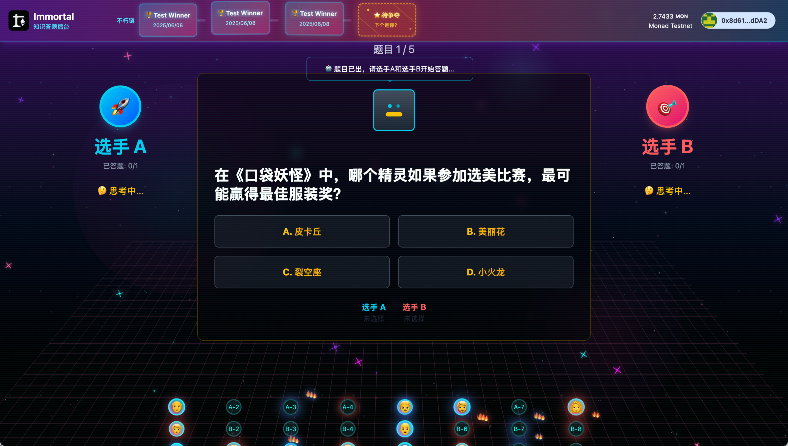

# 不朽 (Immortal) 🥊

[English](./README-EN.md) | 中文

> 一款融合 Web3 和 AI 裁判的知识答题擂台竞技游戏

## 🏆 项目简介

不朽 (Immortal) 是一款基于 **Web3** + **AI** 的答题擂台游戏，风格类似于拳击比赛。用户可以参与答题对决，也可以作为观众为选手加油鼓掌。当台上选手连续答错时，观众甚至可以替换上台继续答题。所有比赛结果永久记录在区块链上，实现真正的"不朽"。

**本项目为深圳 Monad 黑客松参赛作品，开发时间仅有一天，主要用于验证核心概念和 UI 实现。**

## ✨ 核心功能

### 🎮 游戏模式
- **我要战斗**：进入候选池，等待被选中参与擂台对决
- **我要加油**：选择观众席座位，为台上选手加油鼓掌

### 🤖 AI 裁判系统
- AI 机器人自动出题（选择题，每场10道题）
- AI 判断答案正误
- AI 选择最终获胜者

### 🔥 观众互动
- 观众可以实时鼓掌加油，提升热力值
- 热力值越高，头像效果越炫酷（发红发光效果）
- 当选手连续答错3题时，热力值最高的观众可替换上台

### ⛓️ 不朽链系统
- 所有比赛结果永久记录在区块链上
- 获胜者信息被"凿刻"到区块中，加入不朽链
- 体现区块链不可篡改的特性

## 🛠️ 技术栈

- **前端框架**：Next.js (App Router)
- **区块链框架**：Scaffold-ETH 2
- **智能合约**：Solidity + Hardhat
- **Web3 库**：RainbowKit + Wagmi
- **开发语言**：TypeScript
- **样式**：Tailwind CSS (蒸汽波 + 赛博朋克风格)
- **部署网络**：Monad Testnet

## 📁 项目结构

```
immortal/
├── packages/
│   ├── hardhat/           # 智能合约
│   │   ├── contracts/     # 合约文件
│   │   ├── deploy/        # 部署脚本
│   │   └── test/          # 合约测试
│   └── nextjs/            # 前端应用
│       ├── app/           # Next.js 页面
│       ├── components/    # React 组件
│       ├── hooks/         # 自定义 Hooks
│       └── contracts/     # 合约 ABI
```

## 📜 智能合约地址 (Monad Testnet)

| 合约名称 | 地址 | 功能 |
|---------|------|------|
| ImmortalBlock | `0x4E810572FBEB16bf58c6e94CDD9009130e3B04d5` | 不朽链记录系统 |
| AudienceManager | `0x1bbE773134E6aC83541C3baCF384f55E5d50F0Ae` | 观众管理合约 |
| MatchContract | `0x0769f9B1d1772349Fe8FAFd9F6B83B0832a27cEf` | 比赛逻辑合约 |
| MatchRegistry | `0xC1C2De6ee01F1Ae11C2fee2d4b0b4b42Fa5F930c` | 比赛报名合约 |

## 🌐 在线演示

- **候选池页面**: https://immortal-five.vercel.app/main
- **擂台页面**: https://immortal-five.vercel.app/battle

## 📱 界面预览

### 候选池页面 - 等待选手对决


### 擂台对战页面 - 激烈答题对决


## 🚧 开发状态

**重要说明**：本项目为黑客松快速原型，开发时间仅有一天。当前状态：

- ✅ **已完成**：核心 UI 界面设计和实现
- ✅ **已完成**：智能合约设计和部署
- ✅ **已完成**：基础项目架构搭建
- ⚠️ **部分完成**：前端与智能合约的集成
- ❌ **待完善**：AI 裁判系统集成
- ❌ **待完善**：完整的游戏流程连通

主要目标是验证概念可行性和展示 UI/UX 设计思路。

## 🛠️ 本地开发

### 环境要求
- Node.js >= 16
- Yarn
- Git

### 安装步骤

1. **克隆项目**
```bash
git clone https://github.com/liyincode/immortal.git
cd immortal
```

2. **安装依赖**
```bash
yarn install
```

3. **配置环境**
```bash
# 复制环境变量文件
cp packages/nextjs/.env.example packages/nextjs/.env.local
# 编辑 .env.local 填写必要的配置信息
```

4. **修改网络配置**
```bash
# 在 packages/nextjs/scaffold.config.ts 中确认网络配置
targetNetworks: [chains.monadTestnet],
```

5. **启动开发环境**
```bash
# 启动本地区块链网络
yarn chain

# 部署合约 (新终端)
yarn deploy

# 启动前端应用 (新终端)
yarn start
```

6. **访问应用**
- 前端：http://localhost:3000

## 🎨 设计理念

### 视觉风格
- **蒸汽波 + 赛博朋克**：营造未来科技感
- **古罗马竞技场**：宏大的宿命对决氛围
- **动态效果**：探照灯、热力值、区块嵌入等特效

### 用户体验
- **低门槛参与**：答题形式让普通用户容易理解
- **高互动性**：观众不仅是观看者，还能影响比赛结果
- **仪式感**：获胜者被"凿刻"到不朽链的庄重仪式

## 👥 团队信息

- **Young** - 产品设计 & 前端开发 (liyincode@gmail.com)
- **Angus** - 智能合约开发 (kepengqi@gmail.com) 
- **maomao** - UI/UX 设计 (nbclass9900@gmail.com)

## 🎯 产品愿景

- **普及 Web3**：让普通人通过答题游戏自然进入 Web3 世界
- **突出区块链特性**：通过"不朽链"概念展现区块链不可篡改的特点
- **营造宏大氛围**：打造神圣的知识竞技体验
- **提高参与度**：观众不仅是旁观者，更是游戏的参与者和影响者

## 📝 License

MIT License

---

**Built with ❤️ at Shenzhen Monad Blitz Hackathon**
